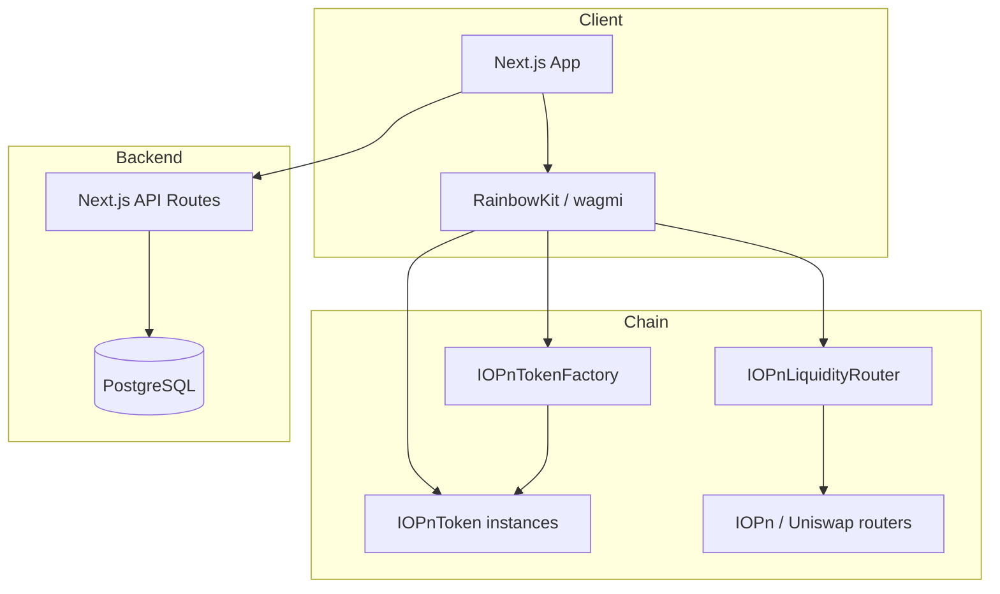

# Architecture

## System overview

## Packages

### `@iopn/contracts`

- **IOPnTokenFactory** — deploys tokens; pausable; AccessControl for operators
- **IOPnToken** — ERC20 with immutable `FEATURE_FLAGS` and optional modules
- **IOPnLiquidityRouter** — adapter only; routes `addLiquidity` to external DEX routers

### `@iopn/database`

Prisma models: `TokenProject`, `User`, `WatchlistItem`, `TokenVote`, `CreatorVerification`, `MetadataUpdate`.

On-chain state is source of truth for token economics; off-chain DB powers discovery, metadata, and community features.

### `@iopn/web`

App Router pages:

| Route | Purpose |
|-------|---------|
| `/create` | Multi-step token deploy + metadata |
| `/discover` | Discovery hub sections |
| `/token/[address]` | Project detail, votes, watchlist |
| `/token/[address]/ownership` | Transfer / renounce |
| `/token/[address]/liquidity` | Approve + add liquidity |
| `/verify` | Creator sign-message verification |
| `/watchlist` | User watchlist |

## Immutable feature flags

Feature bits are set in the factory `createToken` call and stored as `immutable FEATURE_FLAGS` on each token. No upgrade path exists to add or remove features post-deploy.

## Tax model

- Buy/sell tax capped at **500 bps (5%)** in `TokenFeatures` library
- Distribution wallets + bps must sum to **10_000 (100%)** at deploy
- Six destinations: marketing, development, treasury, community, operations, liquidity

## Anti-bot

Launch guard with max launch buy, max launch wallet, and protection duration. **No** wallet cooldown or “buy twice in 30 seconds” logic.
